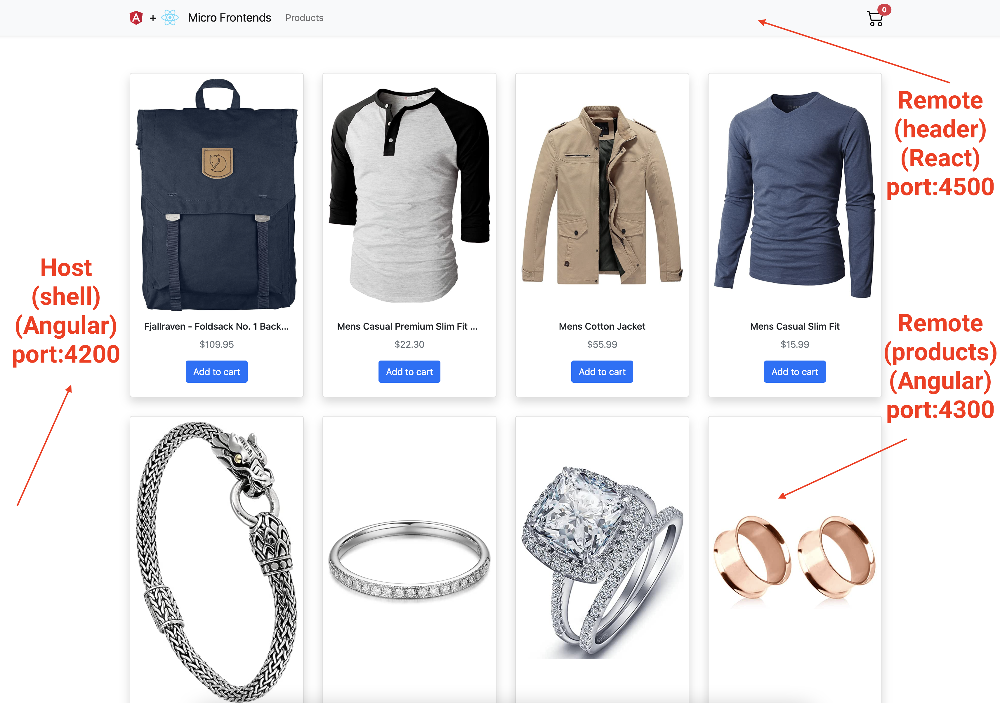
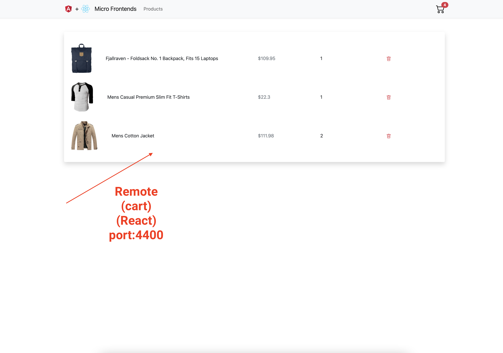

# angular-with-react-micro-frontends-example

Angular with React as Micro Frontends within Nx Workspace.





## How to Run Locally

### Install packages

```shell
npm i
```

### Run in Development mode

```shell
npm run serve:mfe
```

### Run in Production mode

```shell
npm run build:mfe
```

```shell
npm run serve:build:mfe
```
